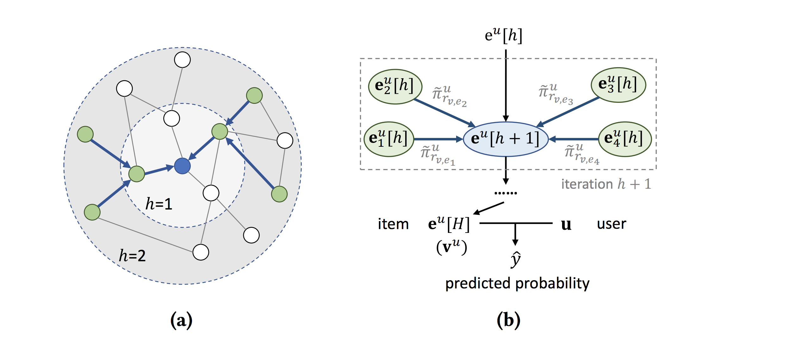

# KGCN

This repository is the implementation of KGCN recommendation framework implemented under Python 3.10.11, Tensorflow 2.12.0 and NumPy 1.22.4



KGCN is **K**nowledge **G**raph **C**onvolutional **N**etworks for recommender systems, which uses the technique of graph convolutional networks (GCN) to proces knowledge graphs for the purpose of recommendation.


### Files in the folder

- `data/`
    - `item_index2entity_id.txt`: the mapping from item indices in the raw rating file to entity IDs in the KG;
    - `kg.txt`: knowledge graph file;
    - `ratings_1M.csv`: ratings dataset for MovieLens 1M dataset;
- `src/`: implementations of KGCN.


### Running the code
- MovieLens 20M
  (The raw rating file of MovieLens-20M is too large to be contained in this repository.
  Download the dataset first.)
  - ```
    $ wget http://files.grouplens.org/datasets/movielens/ml-20m.zip
    $ unzip ml-20m.zip
    $ mv ml-20m/ratings.csv data/
    $ cd src
    $ python preprocess.py
- MovieLens 1M
  - ```
    $ cd src
    $ python preprocess.py
    ```
open `src/main.py` file;
    
comment/uncomment the code blocks of MovieLens 20M;
    
comment/uncomment the code blocks for MovieLens 1M;

run the following 
```
  $ python main.py
```